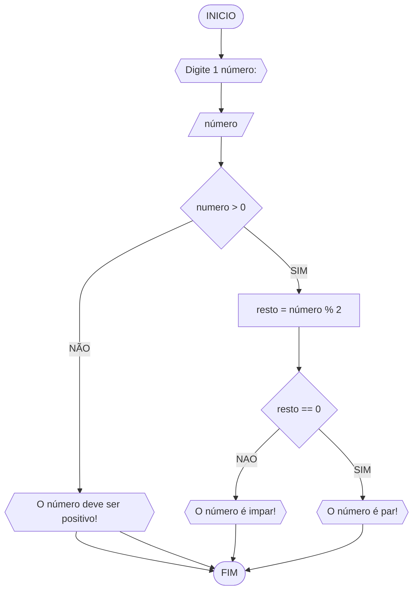

# **UNIFOR**
Disciplina: **Raciocínio Lógico algorítmico**
**Orientador:** Prof. Ricardo Carubbi

## **LISTA 1 DE EXERCÍCIOS**

### **Exercício 03**
Represente em fluxograma e pseudocódigo, um algoritmo para determinar se um número inteiro e positivo é par ou ímpar. 

#### **Fluxograma**




```
ALGORITMO verifica_par_impar
DECLARE numero, resto INTEIRO
ESCREVA "Digite um número:"
LEIA  numero
SE numero > 0 ENTAO	
    resto = numero % 2
    SE resto == 0 ENTAO
       ESCREVA  "O número é par!"
   SENAO	
       ESCREVA "O número é ímpar!"	
   SENAO 
        ESCREVA "O numero deve ser positivo!"
 FIM             

